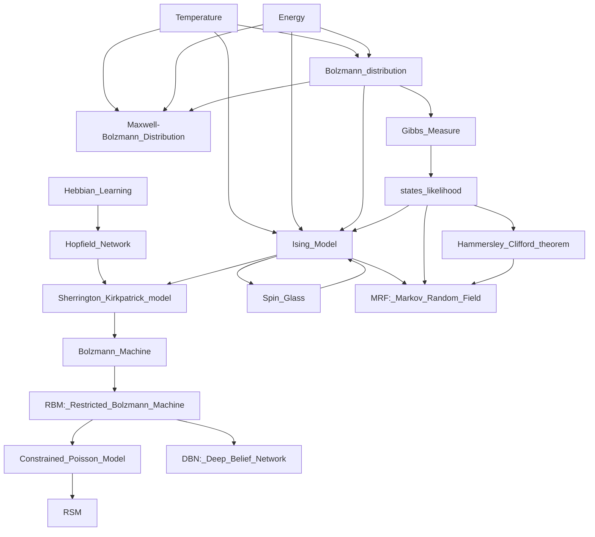
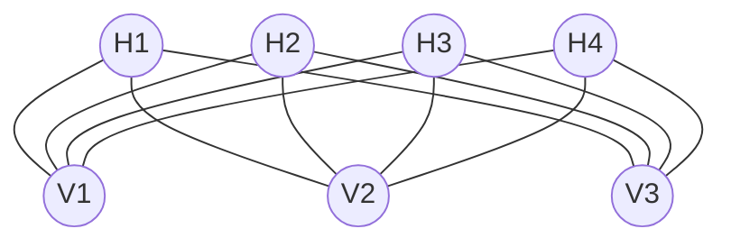
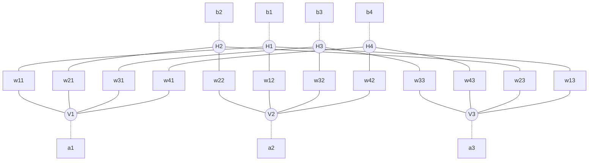

# RSM

*concepual graph: the history behind RSM*

![image]

## The Bolzmann distribution

Here I describe each of the three interconnected distributions with their pdf's.
The Gibbs Measure, the Bolzmann Distribution and the Maxwell-Bolzmann distribution are very similar. All of them express a relation between the concepts of energy and probability. Given a system, this can results in different states, or configurations.
A state in which the system has higher energy, so higher tension, is less likely to be observed, because the tension of the system usually brings it to a  new stable state. So lower the enery, more stable the system is, lower the frustation and so higher the probability that the system is found in that particular state. Another important concept is the one of temperature: the temperature is a constant, independent from the energy, that increases the disorder and can be seen as the natural noise of the system, that cannot be removed. Is it's natural frustation, that cannot be changed with a different configuration.
The Bolzmann/Gibbs distribution describes the probabilities of the possible states/configurations of a system in general (any kind of physical system made of particles). 
The Maxwell-Bolzmann distribution is a particular case of the Bolzmann distribution informed of a physical thermodinamics process, and describes the velocity of a gas particle. The Maxwell-Bolzmann distribution isn't a distribution over the energy of the system, but over the velocity of the particle. The energy implicitly used in the Maxwell-Bolzmann dist is the kinetic energy, that is function of the velocity given other physical parameters.
The Bolzmann distribution refers to a process where we can describe the temperature $T$ and the Bolzmann constant $k$ individually.

Bolzmann distribution:
$$P(X=x_i) = \frac{1}{Z}\exp(-\frac{E(x_i)}{kT})$$
were
$$Z = \sum_{x}\exp(-\frac{E(x)}{kT})$$
is a normalization constant and is said to be the **partition function**

Were $E$ is the energy function, $T$ is the temperature and $k$ is the Bolzmann constant. 
The Gibbs Measure is a reformulation of the Bolzmann distribution, where we specify just the parameter $\beta = \frac{1}{kT}$.
The RBM's assumes $\beta=1$.

Gibbs measure:
$$P(X=x_i) = \frac{1}{Z}\exp(-\beta E(x_i))$$
were the partition function is
$$Z = \sum_{x}\exp(-\beta E(x))$$
and $\beta$ is interpreted as $\frac{1}{T}$

## Interpretation of the Bolzmann distribution

Given a (themodynamic) system, a set of states that the system can get as value, an energy function $E$, that take as input the state of the system , a temperature of the system thata is constant $T$ , an additional constant k, said to be the Bolzmann constant, then the Bolzmann distribution describes the probability that the system results in a particular state or configuration.
In the Maxwell-Bolzmann dist, that describes only the velocity of gas particles, a state can be described as a couple of the two real vectors position and momentum inside an Hamiltonian system. This is the meaning behind the Maxwell-Bolzmann distribution. But the more general and simple Bolzmann distribution is based on the intuition behind the Insing model of the frustration inside a magnetic field.

## most "simple" physical application of the Bolzmann distribution: the Ising model and the spin-glass problem.

The Ising model describes the magnetism of a material.
It was used to describe the transition of a material from ferromagnetic to paramagnetic when the temperature of the material arises above the Curie point.

Some materials are ferromagnetic: it means they are more stable and with low energy, and the Bolzmann density gives them higher likelihood. They're like many magnets ordered in a way that they are all attracted one to another, and are similar.
Others are paramagnetic: it means they have a higher energy, and aren't oriented in the same direction, and are less likely by the Bolzmann dist.
In a spin-glass model, we represent the particles of the material as spins connected in a reticular graph, were each spin has a specific direction $s_i$ and there is an interaction factor $J_{ij}$ that represents the connection between the nodes i and j. 

The energy of a system is:

$$E(s) = -\sum_{ij} s_is_jJ_{ij} - B\sum_{i}^Ks_i$$

Is the energy of the system G, that is a graph (V, E)=(S, J) were $J_ij=0$ if nodes i and j are not connected, otherwise $J_{ij} \in \R$ so can have both signs. K is the number of nodes.
The first term represents the energy deriving from the interaction inside the system, while the second summation is the energy produced by the interaction between the elements of the system and the external random field.
B gives a weigth of the external random field, so add a bias to the energy, and represents the additional energy deriving from the interaction form the environment.

Assuming that $J_{ij}=1$ for any connected two nodes, B=0 and $s \in \{0,1\}^K$ then is easy to interpret:

$$E(s) = -\sum_{ij} s_is_j$$

We see that the energy is higher when the two connected spins are equals ($s_is_j=1$) and lower when they are different ($s_is_j=-1$).
(Note: In Hebbian Theory, two neurons can take values in {0,1} and their connection is 1 only if both are 1. This led's to the quote "neurons that fire together wire together")
A more stable system should have lower energy, and this is minimum (but maximum in absolute value) when all the connected elements are equal.
Notes that inside the Gibbs Measure the energy is multiplied by -1:

$$P(X=x_i) = \frac{1}{Z}\exp(-\beta E(x_i))$$

So if the energy is very low and negative then the argument of the exponential is positive, and the probability of the configuration grows. If the term $\beta$ is small, it means that temperature $T$ is high and so both the temperature (constant) and the energy (variable) are inversely related to the Bolzmann density.

##### Notation of Bolzmann Distribution
| Object    | Description |
| -------- | ------- |
| $E$   | energy function of the system|
| $e_i = E(\textbf{x}_i)$   | energy of state i|
| $T$   | Temperature |
| $\beta=\frac{1}{T}$   |  |
| $\textbf{x}\ or\ \textbf{s}$   | specific state/configuration of the system|
| $Z$ | partition function/normalizing unknown constant |

##### Notation of RBM

| Object    | Description |
| -------- | ------- |
| N  | number of documents/observations|
| F  | number of hidden units|
| D  | number of visible units/ dictionary size|
| n | index of obs n=1,..,N|
| j | index of hidden unit j=1,..,F|
| i | index of visible unit i=1,..,D|
| $\textbf{h}$ | hidden layer: vector of hiddens |
| $\textbf{v}$ | visible layer: vector of 1hot binary visibles |
| $h_j$ | hidden unit, for j=1,..,F|
| $v_i$ | visible unit, for i=1,..,D, inside binary vector $\textbf{v}$|
| $b_j$ | hidden bias, for j=1,..,F|
| $a_i$ | visible bias, for i=1,..,D|
| $\sigma$ | sigmoid function     |
| $\gamma$ | learning rate     |
| $w_{ij}$ | connection weight between $v_i$  and $h_j$. It is a symmetric interaction term, so it does not change from i to j and viceversa|

#### Notation additional elements for RSM

| Object    | Description |
| -------- | ------- |
| K  | #words, and so vectors like $\textbf{v}$, seen as 1hot vector|
| k | index of word k=1,..,K when we have $\textbf{V}$ DxK matrix|
| $\textbf{V}$ | document vector of dim KxD or K-dimensional vector multinomial vector of size parameter D, were K is the number of words and D is the dictionary size (Hinton said the opposite, but I prefer this to compare with RBM)|
| $v_{ik}$ | visible unit, for i=1,..,D, and k=1,..K inside binary matrix $\textbf{V}$|

## Restricted Bolzmann Machine
A RBM is an energy based model, that isn't causal (it means that the hidden variables aren't the cause of the visible variables, but that there is a symmetric relation between the layers).
A RBM encodes the energy of a system in an unsupervised neural network with 2 layers, with any activation functions.
The assumptions of the model are:
- the visible units of the system are available, and are the inputs of the network
- there are k hidden units that are conditionally independent between them given the visisble layer
- the units of the visible layer are conditionally independent between them given the hidden layer
- the connection between the two layers is linear between their activation functions

In the classical Bolzmann Machine, all the units are connected, with symmetric weigths.
So the their energy would be similar to the one of RBM, with two additional terms.
$$E(\textbf{v}, \textbf{h})= -\sum_{i=1}^D\sum_{j=1}^Kw_{ij}v_ih_j - \sum_{i=1}^D v_ia_i-  \sum_{j=1}^F h_jb_j - \sum_{i\neq i'}w_{ii'}v_iv_{i'} - \sum_{j\neq j'}w_{jj'}h_jh_{j'}$$

So the restriction of RBM implies that we have two sets of interaction weigths less to estimates.

The energy of the model then is:

$$E(\textbf{v}, \textbf{h}) = -\sum_{ij}w_{ij}v_ih_j - \sum_i v_ia_i-  \sum_j h_jb_j $$

$$E(\textbf{v}, \textbf{h})= -\sum_{i=1}^D\sum_{j=1}^Kw_{ij}v_ih_j - \sum_{i=1}^D v_ia_i-  \sum_{j=1}^F h_jb_j$$

$$E(\textbf{v}, \textbf{h}) = -\textbf{v}^t\textbf{Wh} - \textbf{a}^t\textbf{v}  - \textbf{b}^t\textbf{h} $$

were the first summation is the energy of the interaction between nodes/particles and the other 2 are the energy bias of each layer that represents the energy of the interaction between them and the external random field.
We can see that the intercation term $w_{ij}$ is symmetric. This is because of the restriction imposed by the Hopfield Network, from which the Bolzmann Machine was derived. Another restriction that always comes from the Hopfield Network is that inside a Bolzmann Machine no neuron is connected to himself, so that $w_{ii}=0$.
Inside a Restricted Bolzmann Machine this problem does not appear, because of the more restrict assumption that there is no connection between neurons inside the same layer (so neither between a neuron and itself).

Which is the probability to have seen a particular object $V$ according to the Bolzmann distribution?

$$P(\textbf{h}) = \frac{1}{Z}\sum_{\textbf{h} \in H}exp(-E(\textbf{v}, \textbf{h}))$$

were we can see that the partition function $Z$, that plays the role of  a normalizing constant, is very hard to compute:

$$Z =\sum_{\textbf{v} \in G} \sum_{\textbf{h} \in H}exp(-E(\textbf{v}, \textbf{h}))$$

were $H$ is the space of all the possible hidden layers $\textbf{h}$ while $G$ is the space of all the possible visible layers $\textbf{v}$

To link with the previous explanations of what the Bolzmann distribution represents, we can see that if we express 
$\textbf{s} = (\textbf{h},\textbf{v}), \textbf{s} \in S$
were $S$ if the space of all the possible states of the system that we want to represent then the partition function as

$$Z =\sum_{\textbf{s} \in S}exp(-E(\textbf{s}))$$

example with 
$F= 4 =  hidden\ units \ h_j$ with intercepts $b_j$ 
$D= 3 =  visible\ units\ v_i$ with intercepts $a_i$

## RBM inference given the parameters

The nodes inside the visible layer and the hidden layer can be described throught any distribution. Usually, the hidden units takes binary values, like 0 or 1, and the visible units are gaussians or multinomial.

In this example, I assume that the visible units are a multinomial vector, with n=1 and so they represents a one-hot vector. This multinomial vector of d elements can be seen as a 

The Restricted Bolzmann Machine are said to be Restricted because given the values of the hidden layer each unit of the visible layer is conditionally independent from the other visible units, and viceversa with the hidden units. So I can express:

$$p(\textbf{v}) = \sum_{\textbf{h}}p(\textbf{h})p(\textbf{v|h})$$

$$p(\textbf{h|v}) = [p(h_j=1|\textbf{v})]_{j=1}^F $$

$$p(h_j=1|\textbf{v}) = \sigma(b_j+\sum_{i=1}^d v_iw_{ij})$$

$$p(h_j=1|\textbf{v}) = \sigma(b_j+\textbf{v}^t\textbf{W}_j)$$

$$p(\textbf{v|h}) = [p(v_i=1|\textbf{h})]_{i=1}^D $$

$$p(v_i=1|\textbf{h}) = softmax_i(a_i + \sum_{j=1}^F h_jw_{ij}) = softmax_i(a_i + \textbf{W}_i^t\textbf{h})$$

$$p(v_i=1|\textbf{h}) = \frac{(a_i + \sum_{j=1}^F h_jw_{ij})}{\sum_i(a_i + \sum_{j=1}^k h_jw_{ij})}$$

$$p(v_i=1|\textbf{h}) = \frac{(a_i + \textbf{W}_i^t\textbf{h}) }{\sum_i(a_i + \textbf{W}_i^t\textbf{h})}$$

were 
$$\sigma(x) = \frac{1}{1+exp(-x)} = \frac{exp(x)}{1+exp(x)}$$

$$softmax_i(x_i) = \frac{x_i}{\sum_ix_i}$$

This functions can be used to sample from one layer the other units of the other, one at the time. The sampling method can be in some cases executed as an acceptance rejection step with a comparison with a uniform distribution:
$$given\  u_i \sim U(0,1) , \ p_i=P(v_i=1|\textbf{h})\ $$
$$if\ u_i<p_i\ then\ \hat{v_i} = 1\ otherwise\ \hat{v_i} = 0$$
Or if we have a known distribution upon the visible unit we can simply sample an observation from it, if its parameters are function of the conditional probability given the hidden layer. For example, if I have a multinomial visible unit with size parameter known, then I can use the predicted conditional probabilities as the probabilities parameters of that multinomial distribution and sample directly from it.

## training with k-contrastive divergence
The CD algorithm implies a simple procedure of Gibbs sampling steps.

**training algorithm**
- initialization: initialize randomly $W$, $a$ and $b$.  
- for t in 1:T:
 using the prediction $P(\textbf{h|v})$ sample a vector $\textbf{h}_0$
- for s in 1:k:
- for n in 1:N:
 using the prediction $P(\textbf{v|h}_{s-1})$ sample a vector $\textbf{v}_s$
 using the prediction $P(\textbf{h|v}_s)$ sample a vector $\textbf{h}_s$
- when $s=k$ estimate the gradients:
 $\Delta W_t= mean_{1:N}(\textbf{v}^t\textbf{h}_0-\textbf{v}_k^t\textbf{h}_k)$
 $\Delta a_t= mean_{1:N}(\textbf{v}-\textbf{v}_k)$
 $\Delta b_t= mean_{1:N}(\textbf{h}_0-\textbf{h}_k)$
- update parameters:
 $W_t = W_{t-1} + \gamma\Delta W_t$
 $a_t = W_{t-1} + \gamma\Delta a_t$
$b_t = W_{t-1} + \gamma\Delta b_t$

#### some possible adjustments to the algorithm

**momentum**
We can specify a parameter momentum to reduce the variability of $\Delta W_t$, for example using:
$$\Delta W_t= m*\Delta W_{t-1} +(\textbf{v}^t\textbf{h}_0-\textbf{v}_k^t\textbf{h}_k)$$
were $m$ can be seen as a memory weight that preserves the inertia of the learning process. The same reasoning can be applied to $\Delta a_t$ and to $\Delta b_t$.

**flexibility of the learning rate**
We can specify a different learning rate $\gamma$ for the three sets of parameters, like $\gamma_a$, $\gamma_b$ and $\gamma_w$.
We can also express the learning rate as a function of some statistics of the learning process.

**early stopping**
We can specify a threshold, such that when a minimum of the loss we have seen is not reached after a certain number of iterations than we keep the weights of the last minimum.

**k contrastive divergence steps**
If k is high, then the computational time increases, but the training tends to be more accurate.

**batchsize and stochastic graidient descent**
If the batchsize is high, then the computational time increases, but the training tends to be more accurate. If we use stochastic gradinet descent, instead of the mean of a bunch of observations, we extract randomly only one or more obs.

**prevent overfitting**
Two possible ways are:
- to keep a validation set, and at each step of training if the **free energy** (that is the unormalized density) is too much lower in train compare to the validation, then stop training
- to use dropout, that means not update all the weights connected to a particular hidden neuron

## bayesian interpretation of the CD algorithm

The parameters update is an application of the basic concept of gradient descent:

$$ W_t = W_{t-1} -\gamma \frac{\partial L(W_{t-1};\textbf{x})}{\partial W}$$

But here $L$ is the log-likelihood $lnP(\textbf{x})$, so we want to  minimize the negative log-likelihood $-lnP$.
It can be shown then that:

$$\frac{\partial lnP(W_{t-1};\textbf{x})}{\partial W_{ij}} = 
\frac{1}{N}\sum_{n=1}^N\frac{\partial lnP(\textbf{v}_n; W_{t-1})}{\partial W_{ij}}  =
\mathbb{E}_{data}(v_ih_j) - \mathbb{E}_{model}(v_ih_j) 
\space\space$$

*(long)* proof:
...

Where $\mathbb{E}_{data}$ is the expected value under the  distribution $P_{data}(\textbf{h,v})=P_{data}(\textbf{v)}p(\textbf{h|v)}$
that we know because:
- $p(\textbf{h|v})$ is given by the RBM
- $P_{data}(\textbf{v)} = \frac{1}{N}\sum_{n=1}^N\delta(\textbf{v}-\textbf{v}_n) = \frac{1}{N}\sum_{n=1}^N\mathbb{I}(\textbf{v}=\textbf{v}_n)$ is the empirical distribution of the data ($\delta$ is the Dirac's delta, that is $\infty$ in 0 and 0 everywhere else)

**while $\mathbb{E}_{model}$ is under $P_{model}$ that is harder to compute (order of $\min\{F, D\}$). So using the CD algorithm we approximate  $P_{model}$ with another distribution $P_{T}$, and then we use Gibbs sampling to get:**

$$\widehat{\frac{\partial lnP(\textbf{x})}{\partial W_{ij}}} = \mathbb{E}_{data}(v_ih_j) - \mathbb{E}_{T}(v_ih_j)$$

We need some unbiased estimates for $\mathbb{E}_{data}(v_ih_j)$ and for $\mathbb{E}_{model}(v_ih_j)$.
We can simply get the first term, because given $\textbf{v}$ we can compute $p(\textbf{h|v)}$ and from there sample an unbiased estimate for $\textbf{h}$. For the second term, we use a Gibbs sampling approach: for k times (from which the k-step CD) we sample the visible from the hiddens, and viceversa. The last sample k of both will be the estimate of $\mathbb{E}_{T}(v_ih_j)$. After a certain number of iterations, the T distribution should become similar to the one of the model. Usually k=1.

## estimating the partition function Z: AIS algorithm
Annealed Importance Sampling (from the family of Annealed Sampling methods) is necessary to compute some normalization constants, like the partition function Z.
Z is necessary if we want to compute the exact Bolzmann probability of a particular state $\textbf{s} = (\textbf{v},\textbf{h})$, and so the likelihood of a dataset $\{\textbf{v}_n\}_{n=1}^N$
We also need Z to compute the perplexity of a topic model, validation measure that requires our capability to compute the probability of a new topic model. So withouth Z we can estimate the model, and we can predict and sample the layes of the network, but we cannot use it to assign a probability to a new observation.

In general, AIS algorithm works in this way:
We have a proposal distribution A that we know well (for example a gaussian or an uniform) and a 

## RSM: RBM applied to topic modeling

## perplexity computation
